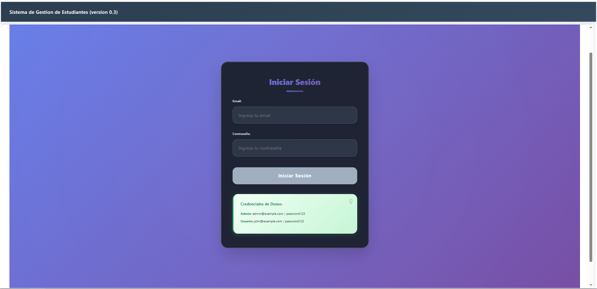
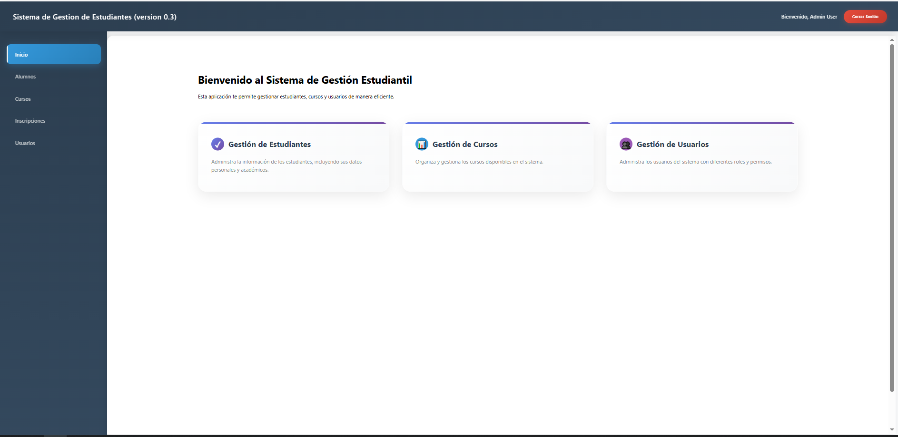

Sistemas de Gestion de Estudiantes
Una aplicación moderna desarrollada en Angular para la gestión integral de estudiantes, cursos, usuarios e inscripciones.

## ✨ CREDENCIALES DEMO PARA EL INICIO 

     Admin: admin@example.com / password123

     Usuario: john@example.com / password123

🚀 Características
 Funcionalidades Principales
Gestión de Estudiantes: CRUD completo de estudiantes

Gestión de Cursos: Administración de cursos disponibles

Sistema de Inscripciones: Control de inscripciones estudiante-curso

Autenticación Segura: Login con roles y protección de rutas

Interfaz Moderna: Diseño responsive y experiencia de usuario mejorada

🛡️ Roles de Usuario
Administrador: Acceso completo a todas las funcionalidades

Usuario: Acceso limitado a consultas y operaciones básicas

🏗️ Arquitectura Técnica
📦 Tecnologías Utilizadas
Angular 17+: Framework principal

NgRx: Gestión de estado global

TypeScript: Tipado estático

RxJS: Programación reactiva

CSS3: Estilos modernos con gradientes y animaciones

## 🗂️ Estructura del Proyecto
src/
├── app/
│   ├── components/          # Componentes de UI
│   ├── services/           # Servicios de API
│   ├── store/             # Estado global NgRx
│   ├── models/            # Interfaces TypeScript
│   ├── pipes/             # Pipes personalizados
│   ├── guards/            # Protección de rutas
│   └── interceptors/      # Interceptores HTTP

🚀 Instalación y Configuración
Prerrequisitos
Node.js 18+

npm o yarn

Angular CLI 17+

📥 Instalación
# Clonar el repositorio
git clone <url-del-repositorio>
cd gestion-estudiantil

# Instalar dependencias
npm install

# Servidor de desarrollo
ng serve

🔧 Configuración de MockAPI
Crear cuenta en mockapi.io

Crear recursos: students, courses, users, inscriptions

Configurar la URL en api.service.ts

const BASE_URL_1 = 'https://68a630e6639c6a54e99e3059.mockapi.io';
const BASE_URL_2 = 'https://68a63f2b639c6a54e99e5050.mockapi.io';

## 📊 Estructura de Datos
👥 Modelo de Usuarios
interface User {
  id: string;
  name: string;
  email: string;
  password: string;
  role: 'admin' | 'user';
  active: boolean;
  createdAt: string;
}
interface Student {
  id: string;
  name: string;
  email: string;
  phone?: string;
  course: string;
  enrollmentDate: string;
}
interface Course {
  id: string;
  name: string;
  instructor: string;
  duration: number;
  description?: string;
  startDate?: string;
}

## 🎯 Diseño Moderno
Glassmorphism: Efectos de vidrio esmerilado

Gradientes Dinámicos: Fondos animados

Responsive Design: Adaptable a todos los dispositivos

Micro-interacciones: Animaciones sutiles y fluidas

## 🎪 Componentes Destacados
Login Interactivo: Con efectos de carga y validación

Tablas Dinámicas: Con sorting y paginación

Formularios Intuitivos: Validación en tiempo real

Dashboard Informativo: Cards con información relevante

## 🔐 Seguridad
🛡️ Medidas Implementadas
Guards de autenticación

Guards de roles

Interceptor de autenticación JWT

Validación en frontend y backend

## 🔒 Roles y Permisos
Rutas protegidas
const routes: Routes = [
  { path: 'admin', canActivate: [AuthGuard, AdminGuard] },
  { path: 'users', canActivate: [AuthGuard] }
];

📱 Responsive Design
📲 Breakpoints Optimizados
Mobile: 0px - 768px

Tablet: 768px - 1024px

Desktop: 1024px+

🚀 Scripts Disponibles
# Desarrollo
npm start
ng serve

# Build producción
npm run build
ng build --configuration production

# Tests
npm test
ng test

# Linting
npm run lint
ng lint

## 📸 CAPTURAS DE PANTALLA

  <h3>Vista de Login</h3>
  
  
  <h3>Vista de Home</h3>
  
  
  <h3>Vista de Sector Cursos</h3>
  

  <h3>Vista de Sector Estudiantes</h3>
  

  <h3>Vista de Sector Inscripciones</h3>
  

  <h3>Vista de Sector Usuarios</h3>
  

  <h3>Nueva Inscripcion</h3>
  

  <h3>Nuevo Estudiante</h3>
  

  <h3>Editar Estudiante</h3>
  

  <h3>Eliminacion de Estudiante</h3>
  

